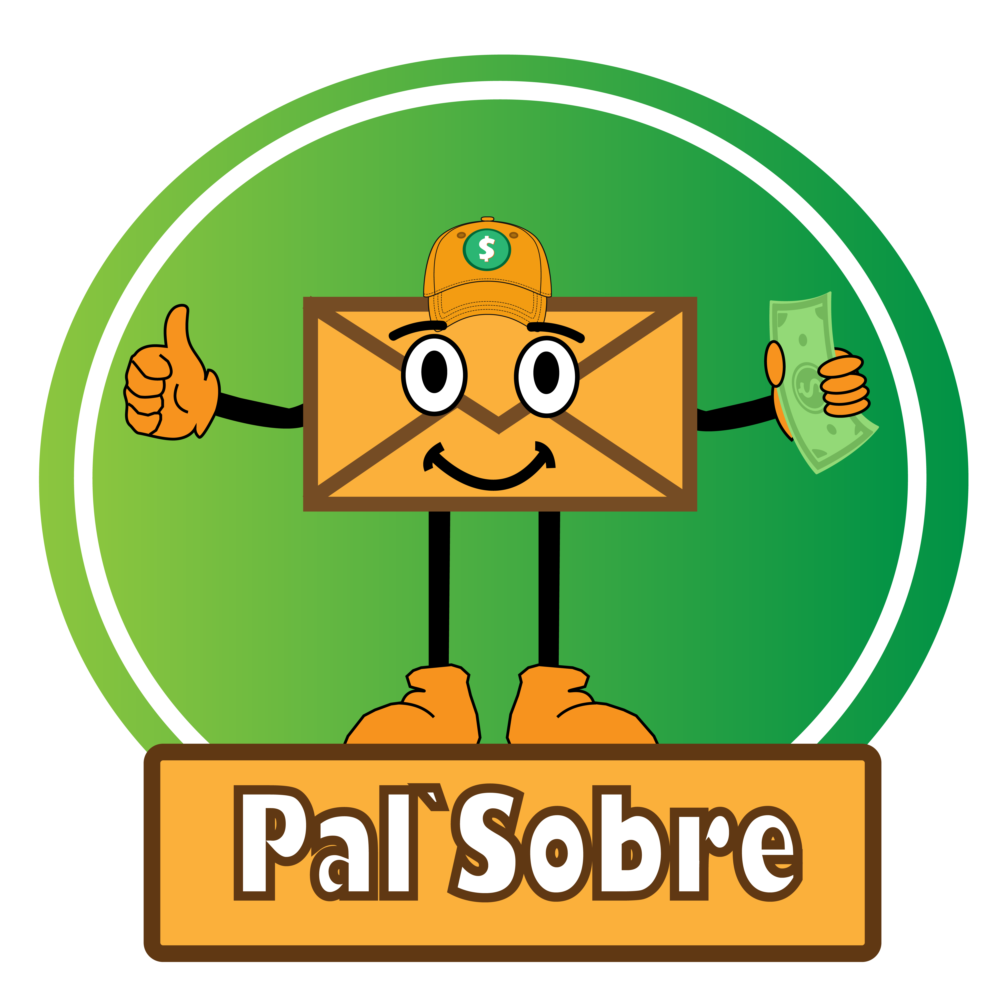

# Pal'Sobre

Calendario de control de gastos.



## Instalación (install)

### Paso 1. Crear entorno virtual

```
virtualenv djenv-sobre
```

### Paso 2. Activar entorno virtual

```
djenv-sobre\Scripts\activate
```

***Para desactivar el entorno virtual:***
```
deactivate
```

***Para eliminar entorno virtual***
```
rm -rf djenv-sobre
```

### Paso 3. Instalar paquetes necesario mediante PIP

```
pip install -r requirements/dev.txt
```

Para fijar o guardar un listado de los paquetes necesario de desarrollo:

```
pip freeze > requirements/dev.txt
```

### Paso 4.  Compilar Archivos Estáticos

```
python manage.py collectstatic
```
